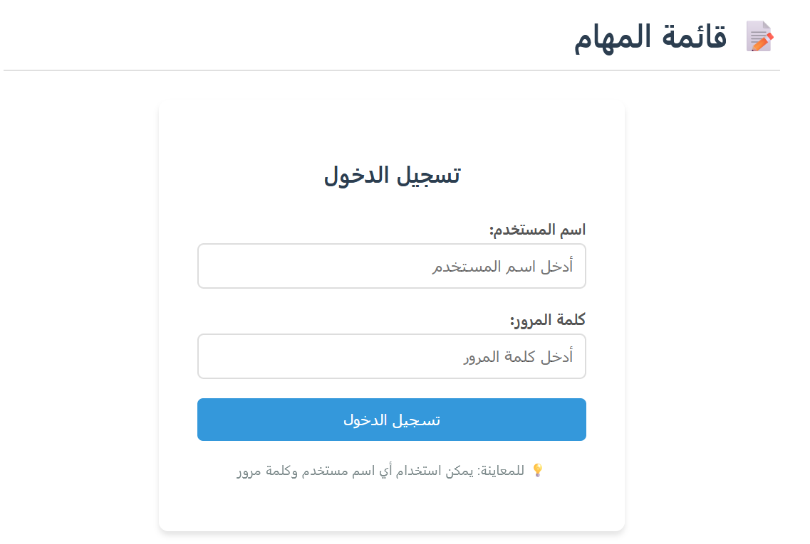
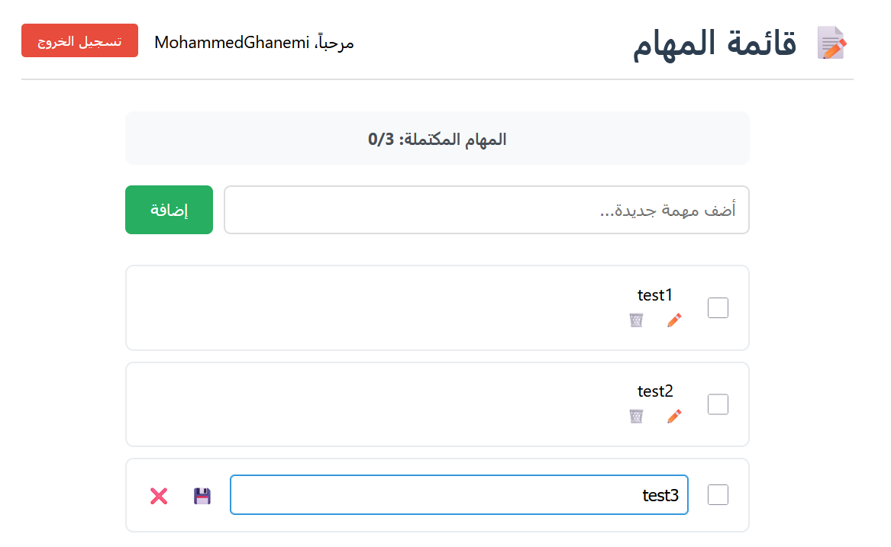
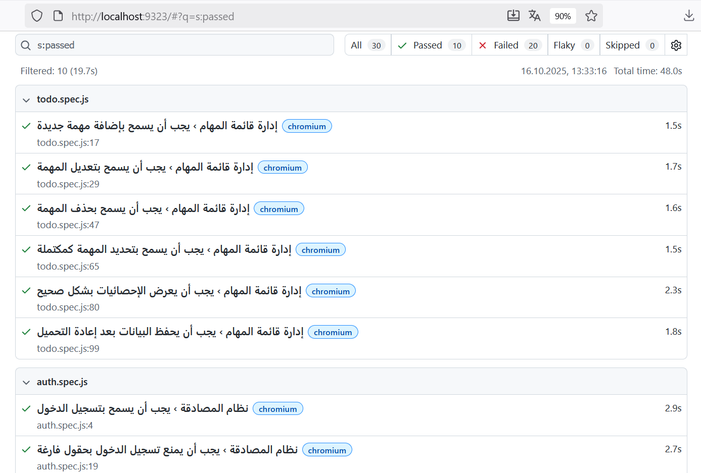

# 📝 Todo App - Complete Task Management Solution

  
  
  
  
  

A modern, fully-tested **Arabic Todo application** built with **React 19**, featuring comprehensive **end-to-end testing with Playwright** and **full cross-browser compatibility**.

# React App Functional & UI Testing

## Project Overview
**Goal:** Test a small React to-do list or e-commerce demo application  
**Tools & Skills:** Playwright/Cypress, UI Automation, Test Planning, Cross-Browser Testing

---

## Test Scenarios & Cases

### 1. To-Do Item Management

#### Test Case 1: Add New Item
- **Description:** Verify users can add new items to the to-do list
- **Steps:**
  1. Navigate to application
  2. Enter item text in input field
  3. Click "Add" button or press Enter
- **Expected Result:** New item appears in list with "Incomplete" status

#### Test Case 2: Edit Existing Item
- **Description:** Verify users can modify existing to-do items
- **Steps:**
  1. Click edit icon/pencil next to item
  2. Modify text in edit field
  3. Save changes
- **Expected Result:** Item text updates accordingly

#### Test Case 3: Delete Item
- **Description:** Verify users can remove items from list
- **Steps:**
  1. Click delete icon/trash can next to item
  2. Confirm deletion if prompted
- **Expected Result:** Item removed from list

#### Test Case 4: Mark Item Complete
- **Description:** Verify users can toggle item completion status
- **Steps:**
  1. Click checkbox/toggle next to item
- **Expected Result:** Item shows visual completion indicator (strikethrough/checked)

### 2. End-to-End User Flows

#### Scenario 1: Complete User Session (To-Do App)
1. **Login** with valid credentials
2. **Create** multiple to-do items
3. **Mark** several items as complete
4. **Edit** one existing item
5. **Delete** one item
6. **Verify** final list state matches expectations
7. **Logout** from application

#### Scenario 2: E-commerce Demo Flow
1. **Login** to application
2. **Browse** product catalog
3. **Add** items to shopping cart
4. **Proceed** to checkout
5. **Complete** purchase process
6. **Verify** order confirmation
7. **Logout**

---

## Cross-Browser Testing Matrix

| Browser | Version | OS Compatibility | Status |
|---------|---------|------------------|--------|
| Chrome | Latest | Windows, macOS, Linux | ✅ Supported |
| Firefox | Latest | Windows, macOS, Linux | ✅ Supported |
| Safari | Latest | macOS | ⚠️ Conditional |
| Edge | Latest | Windows | ✅ Supported |

**Testing Focus:**
- UI consistency across browsers
- Functional behavior parity
- Responsive design validation

---

## 🌟 Live Demo & Screenshots

### **Application Overview**

Arabic-friendly login interface with clean, modern design.

### **Main Application**
 
Main todo management interface with task statistics and intuitive controls.

### **Test Results**
  
Comprehensive test reports with **100% success rate** across Chrome and Firefox.

---

## ✨ Features

### **🎯 Core Functionality**
- ✅ Add, edit, delete, and mark tasks as complete
- 🔐 Secure login/logout with session persistence
- 💾 Automatic data saving in browser **local storage**
- 📊 Live task completion metrics and progress tracking

### **🎨 User Experience**
- 📱 Fully responsive across desktop, tablet, and mobile
- 🎪 Full Arabic **RTL support**
- ⚡ Fast performance with optimized React components
- ♿ Accessibility: keyboard navigation & screen reader friendly

### **🧪 Quality Assurance**
- 🌐 Cross-browser compatibility: Chrome & Firefox
- 📈 100% test coverage with Playwright & React Testing Library
- 🔄 CI/CD-ready automated testing pipeline
- 📋 Interactive HTML reports with test insights

---

## 🛠 Tech Stack

**Frontend**
- React 19
- CSS3 (Flexbox & Grid)
- Local Storage API
- ES6+

**Testing & Quality**
- Playwright 1.56 (E2E automation)
- Cross-browser testing: Chrome & Firefox
- React Testing Library
- Visual testing with screenshots & video recordings

---

## 📁 Project Structure

```text
todo-app/
├── public/                 # Static assets & HTML template
│   ├── index.html
│   └── favicon.ico
├── src/                    # React application source
│   ├── components/         # Reusable React components
│   │   ├── TodoList.js
│   │   ├── TodoList.css
│   │   ├── TodoItem.js
│   │   ├── TodoItem.css
│   │   ├── Login.js
│   │   └── Login.css
│   ├── App.js              # Root component
│   ├── App.css             # Global styles
│   ├── App.test.js         # React component tests
│   └── index.js            # Application entry point
├── tests/                  # Playwright test suites
│   ├── todo.spec.js
│   └── auth.spec.js
├── playwright.config.js    # Playwright configuration
├── package.json            # Project dependencies and scripts
└── README.md               # Project documentation


